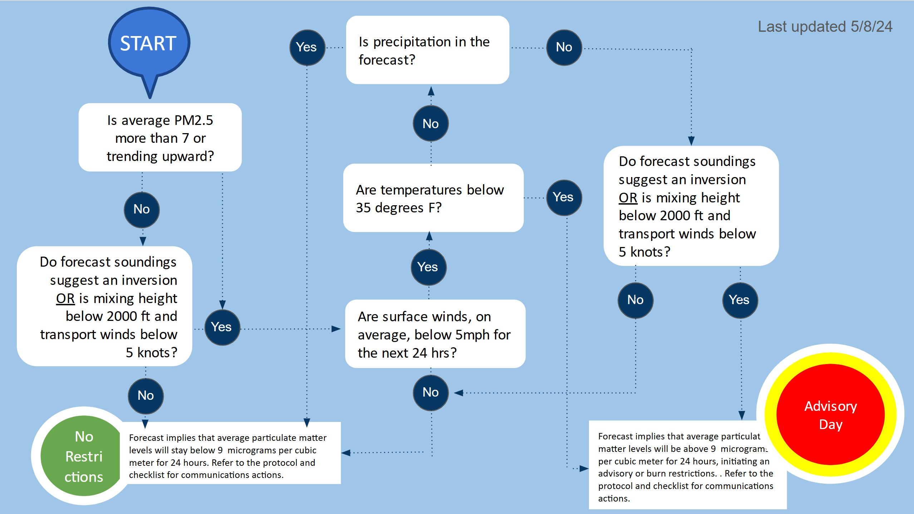

```{r}
#| label: Load Packages and Set Options
#| results: hide
#| message: false
#| warning: false

options(repos = "https://cloud.r-project.org")

if(!require(pacman)) install.packages("pacman")
pacman::p_load(
  tidyverse, httr, stringr, plotly, shiny, reactable,
  kableExtra, scales, xts, dygraphs, rvest, bsicons,
  knitr, rmarkdown, lubridate, DT
)

```


```{css}
/*| echo: false */

/* Hide scrollbars on all html widgets (dygraphs, plotly, etc) */
.html-widget { overflow: hidden !important; }

/* Specific fix for dygraphs sometimes retaining a vertical scroll */
.dygraph-widget { overflow: hidden !important; }

.dygraph-legend {
  left: 60px !important;      /* Force it to the left side */
  top: 40px !important;       /* Force it to the top */
  width: auto !important;     /* Let it shrink to fit text */
  background-color: transparent !important; 
  font-size: 11px !important; /* Keep your font small */
}

.btn-copy-custom {
  background-color: #00e5ff !important; /* Bright Cyan */
  color: black !important;              /* Text color */
  font-weight: bold !important;
  font-size: 11px !important;           /* Smaller text size */
  padding: 2px 6px !important;          /* Smaller button size */
  border: none !important;
  border-radius: 4px !important;        /* Rounded corners */
  margin-bottom: 5px !important;
}

.btn-copy-custom:hover {
  background-color: #00b2cc !important; 
}
```

##  {.sidebar}

Protocol Data Sources:

- [WS Checklist](https://docs.google.com/document/d/1g3VP8Dcw3n0fuAT_0DBjJpdB4E96X0VYV2EPuSS-FSs/edit?tab=t.0#heading=h.i5yaswgf2k4s)
- [OR DEQ AQ Monitoring](https://aqi.oregon.gov/)
- [NOAA Weather Forecast](https://forecast.weather.gov/MapClick.php?lat=45.482920300000046&lon=-122.58685239999994#.W7OU-tNKi71)
- [NCAR Soundings](https://weather.rap.ucar.edu/upper/displayUpper.php?img=KSLE.png&endDate=-1&endTime=-1&duration=0)
- [PacNW Soundings](https://a.atmos.washington.edu/mm5rt/rt/showsounding_d2.cgi?initmodel=GFS&yyyymmddhh=current_gfs&reqhr=30&loc=kpdx&locname=Portland%2COR&latlon=45.59N,122.59W)
- [WSU Airpact](https://airpact.wsu.edu/map.html)

Additional Data:

- [Canada Smoke Forecast](https://www.weather.gc.ca/firework/index_e.html )
- [NOAA HRRR Smoke](https://apps.gsl.noaa.gov/smoke/)
- [BlueSky Smoke](https://tools.airfire.org/websky/v2/#status)
- [Canada Forecast](https://weather.gc.ca/)
- [IWFAQRP](https://outlooks.airfire.org/outlook?)
- [AirNow](https://fire.airnow.gov/#8.12/45.205/-121.949)
- [PurpleAir](https://map.purpleair.com/air-quality-standards-brazilian-pm25?opt=%2F1%2Fi%2Flp%2Fa10%2Fp604800%2FcC5#10.29/45.5355/-122.706)
- [DEQ AQ Advisory](https://experience.arcgis.com/experience/bff67fd99df247bf8ae7435dbfdc31df/)
- [Fire Dashboard](https://experience.arcgis.com/experience/6329d5e4e13748b9b9f7f33f06a3c376/)
- [NOAA/NWS AQ Forecast](https://airquality.weather.gov/?element=ozone01_bc&mapcenter=-100.52%2C39.92&mapzoom=5.079715935041019&subregion=CONUS&region=CONUS)
- [MODIS](https://ge.ssec.wisc.edu/modis-today/)
- [NOAA GOES](https://www.star.nesdis.noaa.gov/GOES/sector_band.php?sat=G17&sector=pnw&band=GEOCOLOR&length=12)
- [PDX Fire](https://x.com/PDXFire)

2025 Operations:

- [Calendar 2025](https://docs.google.com/spreadsheets/d/1V126h6-y0x3mxgt6WW8tl7srMtFIeKEo2hpFJf791f8/edit?gid=60679751#gid=60679751)
- [WF Staffing 2025](https://docs.google.com/spreadsheets/d/1gBoaZXhJlHC_A5RAWnMkzyslcEDADuyO4SgM13KGLM0/edit?gid=0#gid=0)
- [DEQ Smoke Call 2025](https://docs.google.com/document/d/1i_0W5F-yobNtvXpxOflYDsHqSMA5KbLMfGKE31BKng4/edit?tab=t.0#heading=h.alpuuam1yre8)
- [WF Resources Leadership](https://docs.google.com/document/d/1ss1jjZlyREo9MtbtPITc0OXFG5EFyKCRh3RHw8HSKEo/edit?tab=t.0)

---

Updated: `r format(Sys.time(), '%B %d, %Y at %I:%M %p %Z', tz = 'US/Pacific')`

# Pollutants
```{r}
#| label: Load and Prep Data
#| results: hide
#| message: false
#| warning: false

load("data/hourlydash.Rdata")
load("data/hourlyobozone.rData")
load("data/hourlyobpm.Rdata")
load("data/hourlyobozone_carus.rData")
load("data/ForecastSummaryToday.Rdata")
load("data/hourlyobno.Rdata")

combined_archive_utc <- read_csv(
  "data/forecast_archive.csv",
  col_types = cols(.default = "d", forecast_run_date = "D", pdxtime = "T")
)

combined_archive <- combined_archive_utc %>%
  mutate(pdxtime = with_tz(pdxtime, tzone = "US/Pacific"))

db_nwsdata <- read.csv("data/ForecastSummaryToday.csv")

latest_nws <- tail(db_nwsdata, 1)

hourlydashtwodays <- combined_archive %>%
  filter(as.Date(pdxtime) >= (Sys.Date() - 2) & as.Date(pdxtime) <= (Sys.Date() + 2)) %>%
  arrange(pdxtime) %>%
  mutate(pdxtime = as.POSIXct(pdxtime))

obspm <- b
obspm$time <- str_extract(b$pdxtime, "(?<= ).*")

theme_set(theme_bw() + theme(panel.border = element_blank(), axis.line = element_line(color = "black")))

pm24hr <- latest_nws$HR24PM
oz24hr <- latest_nws$HR24OZ
peakoz8hr_carus <- latest_nws$peakoz8hr_carus
no2max_24 <- latest_nws$no2max_24

apply_time_shadings <- function(chart, xts_data) {
  all_times <- index(xts_data)
  if(length(all_times) == 0) return(chart)
  
  is_night <- hour(all_times) >= 22 | hour(all_times) < 5
  night_transitions <- diff(is_night)
  night_starts <- all_times[which(night_transitions == 1)]
  night_ends <- all_times[which(night_transitions == -1)]
  
  if (length(is_night) > 0 && is_night[1]) night_starts <- c(all_times[1], night_starts)
  if (length(is_night) > 0 && is_night[length(is_night)]) night_ends <- c(night_ends, all_times[length(all_times)])
  
  if (length(night_starts) > 0) {
    for (i in 1:length(night_starts)) {
      if(i <= length(night_ends)) {
        chart <- chart %>% dyShading(from = night_starts[i], to = night_ends[i], color = "#EAEAEA", axis = "x")
      }
    }
  }
  
  daily_event_dates <- unique(floor_date(all_times, "day"))
  for (event_date in daily_event_dates) {
    chart <- chart %>% dyShading(
      from = event_date - (2 * 60), to = event_date + (2 * 60), color = "black", axis = "x"
    )
  }
  
  start_boundary <- floor_date(start(xts_data), "day")
  end_boundary <- ceiling_date(end(xts_data), "day")
  six_hour_timestamps <- seq(from = start_boundary, to = end_boundary, by = "6 hours")
  
  for (ts in six_hour_timestamps) {
    if (hour(ts) != 0) { 
      chart <- chart %>% dyEvent(x = ts, label = "", color = "grey", strokePattern = "dotted")
    }
  }
  return(chart)
}
```

## PM 2.5 Data
### PM 2.5 Average {width="25%"}
```{r}
#| results: hide
adcolor <- case_when(
  between(pm24hr, 9, 35) ~ "warning",
  pm24hr > 35 ~ "danger",
  .default = "light"
)
```

```{r}
#| content: valuebox
#| title: "Observed 24 PM2.5 Average (Lafayette)"
list(color = adcolor, value = pm24hr)
```

#### Chart Column {width="75%"}
### Actual Chart {.card-body-fill}
```{r}
data_is_valid <- exists("obspm") && is.data.frame(obspm) && nrow(obspm) > 0

if (data_is_valid) {
  obspm <- obspm %>% mutate(pdxtime = as.POSIXct(pdxtime)) %>% arrange(pdxtime) %>% filter(!is.na(pdxtime), !is.na(RawConcentration))
  
  if (nrow(obspm) > 0) {
    pm_xts <- xts(x = obspm$RawConcentration, order.by = obspm$pdxtime)
    
    if (is.xts(pm_xts) && !is.null(nrow(pm_xts)) && nrow(pm_xts) > 0) {
      
      PMchart <- dygraph(pm_xts, main = "PM2.5 Values Over the Past 48 Hours (Lafayette)", ylab = "µg/m³") %>% 
        dySeries("V1", label = "PM2.5", color = "black", drawPoints = TRUE, pointSize = 2) %>% 
        dyAxis("y", label = "PM 2.5 µg/m³", valueRange = c(0, 50)) %>% 
        dyShading(from = 9, to = 35, color = "lightyellow", axis = "y") %>% 
        dyShading(from = 35, to = Inf, color = "mistyrose", axis = "y") %>% 
        dyLimit(9, color = "orange", strokePattern = "dashed", label = "Moderate") %>% 
        dyLimit(35, color = "red", strokePattern = "dashed", label = "Unhealthy for Sensitive Groups") %>% 
        dyHighlight(highlightCircleSize = 4, highlightSeriesBackgroundAlpha = 0.3) %>% 
        dyCrosshair(direction = "vertical") %>% 
        dyOptions(gridLineColor = "lightgrey", digitsAfterDecimal = 1) # HOVER DECIMAL ADDED HERE
      
      if (length(index(pm_xts)) > 0) {
        daily_event_dates <- unique(floor_date(with_tz(index(pm_xts), "US/Pacific"), "day"))
        for (event_date in daily_event_dates) {
          PMchart <- PMchart %>% dyShading(from = event_date - (2 * 60), to = event_date + (2 * 60), color = "black", axis = "x")
        }
      }
      PMchart
    } else { cat("Error: Data could not be converted to time-series format (xts).") }
  } else { cat("No valid PM2.5 data available (all values were NA).") }
} else { cat("No PM2.5 data available for this selection.") }
```

## Ozone Data
### Ozone Average {width="25%"}
```{r}
#| results: hide
ozcolor <- case_when(
  between(peakoz8hr_carus, 55, 69.9) ~ "warning",
  peakoz8hr_carus > 70 ~ "danger",
  .default = "light"
)
```

```{r}
#| content: valuebox
#| title: "Yesterday's Observed 12p-8p Ozone Average (Carus)"
list(value = sprintf("%.1f", peakoz8hr_carus), color = ozcolor)
```

### Ozone Chart {width="75%"}
```{r}
ozone_is_valid <- exists("raw_ozone_carus") && is.data.frame(raw_ozone_carus) && nrow(raw_ozone_carus) > 0

if (ozone_is_valid) {
  raw_ozone_carus <- raw_ozone_carus %>% mutate(pdxtime = as.POSIXct(pdxtime)) %>% filter(!is.na(pdxtime), !is.na(RawConcentration)) %>% arrange(pdxtime)

  if (nrow(raw_ozone_carus) > 0) {
    oz_xts <- xts(x = raw_ozone_carus$RawConcentration, order.by = raw_ozone_carus$pdxtime)

    OZchart <- dygraph(oz_xts, main = "Ozone Values Over the Past 48 Hours (Carus)", ylab = "PPB") %>%
      dySeries("V1", label = "Ozone", color = "black", drawPoints = TRUE, pointSize = 2) %>%
      dyAxis("y", label = "PPB", valueRange = c(0, 100)) %>%
      dyShading(from = 55, to = 69.9, color = "lightyellow", axis = "y") %>%
      dyShading(from = 70, to = Inf, color = "mistyrose", axis = "y") %>%
      dyLimit(55, color = "orange", strokePattern = "dashed", label = "Moderate") %>%
      dyLimit(70, color = "red", strokePattern = "dashed", label = "Unhealthy for Sensitive Groups") %>%
      dyHighlight(highlightCircleSize = 4, highlightSeriesBackgroundAlpha = 0.3) %>%
      dyCrosshair(direction = "vertical") %>%
      dyOptions(gridLineColor = "lightgrey", digitsAfterDecimal = 1) # HOVER DECIMAL ADDED HERE

    daily_event_dates <- unique(floor_date(with_tz(index(oz_xts), "US/Pacific"), "day"))
    for (event_date in daily_event_dates) {
      OZchart <- OZchart %>% dyShading(from = event_date - (2 * 60), to = event_date + (2 * 60), color = "black", axis = "x")
    }
    OZchart
  } else { cat("No valid Ozone data available (all retrieved values were NA).") }
} else { cat("No Ozone data available for this selection.") }
```


# Temp/Wind
## Temperature
### Temperature Chart {width="60%"}
```{r}
temp_xts <- xts(x = hourlydashtwodays$tempfillf, order.by = hourlydashtwodays$pdxtime)

tempchart <- dygraph(temp_xts, main = "Temperature", ylab = "(F)") %>%
  dySeries("V1", label = "Temperature", color = "red") %>%
  dyShading(from = 80, to = 84.9, color = "rgba(250, 250, 210, 0.4)", axis = "y") %>%
  dyShading(from = 85, to = 89.9, color = "rgba(255, 228, 196, 0.4)", axis = "y") %>%
  dyShading(from = 90, to = 120, color = "rgba(255, 228, 225, 0.4)", axis = "y") %>%
  dyAxis("x", drawGrid = FALSE) %>%
  dyAxis("y", drawGrid = TRUE, valueRange = c(10, 120), gridLineColor = "lightgrey") %>%
  dyHighlight(highlightCircleSize = 5, highlightSeriesBackgroundAlpha = 0.5) %>%
  dyLegend(show = "onmouseover", width = 400, labelsSeparateLines = FALSE) 

tempchart <- apply_time_shadings(tempchart, temp_xts)

tempchart$x$attrs$legendFormatter <- htmlwidgets::JS(
  "function(data) {
      var html = '';
      data.series.forEach(function(series) {
        if (!series.isVisible) return;
        html += '<span style=\"font-weight: bold;\">' + series.labelHTML + ':</span> ' + series.yHTML;
      });
      return html;
   }"
)
tempchart
```

### Min Temp - Today {width=10%}
```{r}
#| results: hide
tempval <- floor(latest_nws$tminToday * 9/5) + 32
tempcolor <- case_when(tempval == 35 ~ "warning", tempval < 35 ~ "danger", .default = "light")
```
```{r}
#| content: valuebox
#| title: Today (Avg)
list(color = tempcolor, value = paste(tempval, "F"))
```

### Min Temp - N2N {width="10%"}
```{r}
#| results: hide
tempval <- floor(latest_nws$tminN2N * 9/5) + 32
tempcolor <- case_when(tempval == 35 ~ "warning", tempval < 35 ~ "danger", .default = "light")
```
```{r}
#| content: valuebox
#| title: Noon Today to Noon Tomorrow
list(color = tempcolor, value = paste(tempval, "F"))
```

### Min Temp - Evening {width="10%"}
```{r}
#| results: hide
tempval <- floor(latest_nws$tminPM * 9/5) + 32
tempcolor <- case_when(tempval == 35 ~ "warning", tempval < 35 ~ "danger", .default = "light")
```
```{r}
#| content: valuebox
#| title: This Evening (6p-12a)
list(color = tempcolor, value = paste(tempval, "F"))
```

### Min Temp - Tomorrow {width="10%"}
```{r}
#| results: hide
tempval <- floor(latest_nws$tminTomorrow * 9/5) + 32
tempcolor <- case_when(tempval == 35 ~ "warning", tempval < 35 ~ "danger", .default = "light")
```
```{r}
#| content: valuebox
#| title: Tomorrow (12a-12a)
list(color = tempcolor, value = paste(tempval, "F"))
```

## Mixing Height
### Mixing Height - Chart {width="60%"}
```{r}
mix_xts <- xts(x = hourlydashtwodays$mixfillft, order.by = hourlydashtwodays$pdxtime)

MHchart <- dygraph(mix_xts, main = "Mixing Height", ylab = "(Feet)") %>%
  dySeries("V1", label = "Mixing Height", color = "black") %>%
  dyAxis("x", drawGrid = FALSE) %>%
  dyAxis("y", drawGrid = TRUE, gridLineColor = "lightgrey", valueFormatter = 'function(d) { return Math.round(d) + " Feet"; }') %>%
  dyHighlight(highlightCircleSize = 5, highlightSeriesBackgroundAlpha = 0.5) %>%
  dyLegend(show = "onmouseover", hideOnMouseOut = TRUE) %>%
  dyShading(from = 0, to = 2000, color = "rgba(255, 228, 225, 0.4)", axis = "y")

MHchart <- apply_time_shadings(MHchart, mix_xts)
MHchart
```

### Mixing Height - Today{width="10%"}
```{r}
#| results: hide
mhval <- floor(latest_nws$mixToday * 3.28084)
mhcolor <- case_when(mhval == 2000 ~ "warning", mhval < 2000 ~ "danger", .default = "light")
```
```{r}
#| content: valuebox
#| title: "Today" 
list(color = mhcolor, value = paste(mhval,"feet"))
```

### Mixing Height - N2N {width="10%"}
```{r}
#| results: hide
mhval <- floor(latest_nws$mixN2N * 3.28084)
mhcolor <- case_when(mhval == 2000 ~ "warning", mhval < 2000 ~ "danger", .default = "light")
```
```{r}
#| content: valuebox
#| title: "Noon Today to Noon Tomorrow"
list(color = mhcolor, value = paste(mhval,"feet"))
```

### Mixing Height - Evening {width="10%"}
```{r}
#| results: hide
mhval <- floor(latest_nws$mixPM * 3.28084)
mhcolor <- case_when(mhval == 2000 ~ "warning", mhval < 2000 ~ "danger", .default = "light")
```
```{r}
#| content: valuebox
#| title: "This Evening (6p-12a)"
list(color = mhcolor, value = paste(mhval,"feet"))
```

### Mixing Height - Tomorrow  {width="10%"}
```{r}
#| results: hide
mhval <- floor(latest_nws$mixTomorrow * 3.28084)
mhcolor <- case_when(mhval == 2000 ~ "warning", mhval < 2000 ~ "danger", .default = "light")
```
```{r}
#| content: valuebox
#| title: "Tomorrow (12a-12a)"
list(color = mhcolor, value = paste(mhval,"feet"))
```

## Surface Wind 
### Surface Wind - Chart {width="60%"}
```{r}
sw_xts <- xts(x = hourlydashtwodays$swindfillmph, order.by = hourlydashtwodays$pdxtime)

SWchart <- dygraph(sw_xts, main = "Surface Wind", ylab = "(MPH)") %>%
  dySeries("V1", label = "Surface Wind", color = "black") %>%
  dyAxis("x", drawGrid = FALSE) %>%
  dyAxis("y", drawGrid = TRUE, gridLineColor = "lightgrey") %>%
  dyHighlight(highlightCircleSize = 5, highlightSeriesBackgroundAlpha = 0.5) %>%
  dyShading(from = 0, to = 5, color = "rgba(255, 228, 225, 0.4)", axis = "y")

SWchart <- apply_time_shadings(SWchart, sw_xts)
SWchart
```

### Surface Wind - Today {width="10%"}
```{r}
#| results: hide
swval <- floor(latest_nws$swindToday * .621371)
swcolor <- case_when(swval == 5 ~ "warning", swval < 5 ~ "danger", .default = "light")
```
```{r}
#| content: valuebox
#| title: Today
list(color = swcolor, value = paste(swval, "mph"))
```

### Surface Wind - N2N {width="10%"}
```{r}
#| results: hide
swval <- floor(latest_nws$swindN2N * .621371)
swcolor <- case_when(swval == 5 ~ "warning", swval < 5 ~ "danger", .default = "light")
```
```{r}
#| content: valuebox
#| title: Noon Today to Noon Tomorrow
list(color = swcolor, value = paste(swval, "mph"))
```

### Surface Wind - Evening {width="10%"}
```{r}
#| results: hide
swval <- floor(latest_nws$swindPM * .621371)
swcolor <- case_when(swval == 5 ~ "warning", swval < 5 ~ "danger", .default = "light")
```
```{r}
#| content: valuebox
#| title: This Evening (6p-12a)
list(color = swcolor, value = paste(swval, "mph"))
```

### Surface Wind - Tomorrow {width="10%"}
```{r}
#| results: hide
swval <- floor(latest_nws$swindTomorrow * .621371)
swcolor <- case_when(swval == 5 ~ "warning", swval < 5 ~ "danger", .default = "light")
```
```{r}
#| content: valuebox
#| title: Tomorrow (12a-12a)
list(color = swcolor, value = paste(swval, "mph"))
```

## Transport Wind
### Transport Wind - Chart {width="60%"}
```{r}
tw_xts <- xts(x = hourlydashtwodays$twindfillknot, order.by = hourlydashtwodays$pdxtime)

TWchart <- dygraph(tw_xts, main = "Transport Wind", ylab = "(Knots)") %>%
  dySeries("V1", label = "Transport Wind", color = "black") %>%
  dyAxis("x", drawGrid = FALSE) %>%
  dyAxis("y", drawGrid = TRUE, gridLineColor = "lightgrey") %>%
  dyHighlight(highlightCircleSize = 5, highlightSeriesBackgroundAlpha = 0.5) %>%
  dyShading(from = 0, to = 5, color = "rgba(255, 228, 225, 0.4)", axis = "y")

TWchart <- apply_time_shadings(TWchart, tw_xts)
TWchart
```

### Transport Wind - Today {width="10%"}
```{r}
#| results: hide
twval <- floor(latest_nws$twindToday * .539957)
twcolor <- case_when(twval < 5 ~ "danger", twval == 5 ~ "warning", .default = "light")
```
```{r}
#| content: valuebox
#| title: Today 
list(color = twcolor, value = paste(twval,"knots"))
```

### Transport Wind - N2N {width="10%"}
```{r}
#| results: hide
twval <- floor(latest_nws$twindN2N * .539957)
twcolor <- case_when(twval < 5 ~ "danger", twval == 5 ~ "warning", .default = "light")
```
```{r}
#| content: valuebox
#| title: Noon Today to Noon Tomorrow
list(color = twcolor, value = paste(twval,"knots"))
```

### Transport Wind - Tonight {width="10%"}
```{r}
#| results: hide
twval <- floor(latest_nws$twindPM * .539957)
twcolor <- case_when(twval < 5 ~ "danger", twval == 5 ~ "warning", .default = "light")
```
```{r}
#| content: valuebox
#| title: This Evening (6p-12p)
list(color = twcolor, value = paste(twval,"knots"))
```

### Transport Wind - Tomorrow {width="10%"}
```{r}
#| results: hide
twval <- floor(latest_nws$twindTomorrow * .539957)
twcolor <- case_when(twval < 5 ~ "danger", twval == 5 ~ "warning", .default = "light")
```
```{r}
#| content: valuebox
#| title: Tomorrow (12a-12am)
list(color = twcolor, value = paste(twval,"knots"))
```

# Rain/Humidity
## Precipitation
### Precipitation - Chart {width="60%"}
```{r}
precip_xts <- xts(x = hourlydashtwodays$precipfill, order.by = hourlydashtwodays$pdxtime)

precipchart <- dygraph(precip_xts, main = "Precipitation Potential", ylab = "(%)") %>%
  dySeries("V1", label = "Precipitation Potential", color = "blue") %>%
  dyAxis("x", drawGrid = FALSE) %>%
  dyAxis("y", drawGrid = TRUE, gridLineColor = "lightgrey") %>%
  dyHighlight(highlightCircleSize = 5, highlightSeriesBackgroundAlpha = 0.5)

precipchart <- apply_time_shadings(precipchart, precip_xts)
precipchart
```

### Precipitation - Today {width=10%}
```{r}
#| results: hide
pval <- floor(latest_nws$precipToday)
precipcolor <- case_when(pval == 20 ~ "warning", pval < 20 ~ "danger", .default = "light")
```
```{r}
#| content: valuebox
#| title: Today
list(color = precipcolor, value = paste(pval, "%"))
```

### Precipitation - N2N {width="10%"}
```{r}
#| results: hide
pval <- floor(latest_nws$precipN2N)
precipcolor <- case_when(pval == 20 ~ "warning", pval < 20 ~ "danger", .default = "light")
```
```{r}
#| content: valuebox
#| title: Noon today to Noon Tomorrow
list(color = precipcolor, value = paste(pval, "%"))
```

### Precipitation - Evening {width="10%"}
```{r}
#| results: hide
pval <- floor(latest_nws$precipPM)
precipcolor <- case_when(pval == 20 ~ "warning", pval < 20 ~ "danger", .default = "light")
```
```{r}
#| content: valuebox
#| title: This Evening (6p-12a)
list(color = precipcolor, value = paste(pval, "%"))
```

### Precipitation - Tomorrow {width="10%"}
```{r}
#| results: hide
pval <- floor(latest_nws$precipTomorrow)
precipcolor <- case_when(pval == 20 ~ "warning", pval < 20 ~ "danger", .default = "light")
```
```{r}
#| content: valuebox
#| title: Tomorrow (12a-12a)
list(color = precipcolor, value = paste(pval, "%"))
```

## Humidity 
### Humidity - Chart {width="60%"}
```{r}
hum_data_for_chart <- hourlydashtwodays %>% filter(!is.na(humfill))
hum_xts <- xts(x = hum_data_for_chart$humfill, order.by = hum_data_for_chart$pdxtime)

humchart <- dygraph(hum_xts, main = "Humidity", ylab = "(%)") %>%
  dySeries("V1", label = "Humidity", color = "blue") %>%
  dyAxis("x", drawGrid = FALSE) %>%
  dyAxis("y", drawGrid = TRUE, gridLineColor = "lightgrey") %>%
  dyLimit(76, color = "black", strokePattern = "dashed", label = "76%") %>%
  dyHighlight(highlightCircleSize = 5, highlightSeriesBackgroundAlpha = 0.5)

humchart <- apply_time_shadings(humchart, hum_xts)
humchart
```

### Humidity - Today {width=10%}
```{r}
#| results: hide
hval <- floor(latest_nws$humToday)
humcolor <- case_when(hval == 20 ~ "warning", hval < 20 ~ "danger", .default = "light")
```
```{r}
#| content: valuebox
#| title: Today
list(color = humcolor, value = paste(hval, "%"))
```

### Humidity - N2N {width="10%"}
```{r}
#| results: hide
hval <- floor(latest_nws$humN2N)
humcolor <- case_when(hval == 20 ~ "warning", hval < 20 ~ "danger", .default = "light")
```
```{r}
#| content: valuebox
#| title: Noon today to Noon Tomorrow
list(color = humcolor, value = paste(hval, "%"))
```

### Humidity - Evening {width="10%"}
```{r}
#| results: hide
hval <- floor(latest_nws$humPM)
humcolor <- case_when(hval == 20 ~ "warning", hval < 20 ~ "danger", .default = "light")
```
```{r}
#| content: valuebox
#| title: This Evening (6p-12a)
list(color = humcolor, value = paste(hval, "%"))
```

### Humidity - Tomorrow {width="10%"}
```{r}
#| results: hide
hval <- floor(latest_nws$humTomorrow)
humcolor <- case_when(hval == 20 ~ "warning", hval < 20 ~ "danger", .default = "light")
```
```{r}
#| content: valuebox
#| title: Tomorrow (12a-12a)
list(color = humcolor, value = paste(hval, "%"))
```

## Cloud Cover 
### Cloud Cover - Chart {width="60%"}
```{r}
cloud_data_for_chart <- hourlydashtwodays %>% filter(!is.na(cloudfill))
cloud_xts <- xts(x = cloud_data_for_chart$cloudfill, order.by = cloud_data_for_chart$pdxtime)

cloudchart <- dygraph(cloud_xts, main = "Cloud Clover", ylab = "(%)") %>%
  dySeries("V1", label = "Cloud Cover", color = "blue") %>%
  dyAxis("x", drawGrid = FALSE) %>%
  dyAxis("y", drawGrid = TRUE, gridLineColor = "lightgrey") %>%
  dyHighlight(highlightCircleSize = 5, highlightSeriesBackgroundAlpha = 0.5)

cloudchart <- apply_time_shadings(cloudchart, cloud_xts)
cloudchart
```

### Cloud - Today {width=10%}
```{r}
#| content: valuebox
#| title: Today
list(value = paste(floor(latest_nws$cloudToday), "%"))
```

### Cloud - N2N {width="10%"}
```{r}
#| content: valuebox
#| title: Noon today to Noon Tomorrow
list(value = paste(floor(latest_nws$cloudN2N), "%"))
```

### Cloud - Evening {width="10%"}
```{r}
#| content: valuebox
#| title: This Evening (6p-12a)
list(value = paste(floor(latest_nws$cloudPM), "%"))
```

### Cloud - Tomorrow {width="10%"}
```{r}
#| content: valuebox
#| title: Tomorrow (12a-12a)
list(value = paste(floor(latest_nws$cloudTomorrow), "%"))
```

# Soundings
## Sounding Titles {height="25%"}
#### Current Sounding Title {width="50%"}
```{r}
#| content: valuebox
#| title: Forecast
list(value = "8-11p Today")
```

#### Forecast Sounding Title {width="50%"}
```{r}
#| content: valuebox
#| title: Forecast
list(value = "8-11a Tomorrow")
```

## Sounding Graphics
#### 8-12 Forecast Sounding Image {width="50%"}
```{r}
# get 8-11p forecast sounding
fcsound_url <- "https://a.atmos.washington.edu/mm5rt/data/current_gfs/images_d2/kpdx.15.0000.snd.gif"
response <- GET(fcsound_url)
if (status_code(response) == 200) {
  image_path_fc <- "fcsound.gif"
  writeBin(content(response, "raw"), image_path_fc)
  include_graphics(image_path_fc)
} else {
  print("Error downloading the sounding image.")
}
```

#### 8-12a Forecast Sounding Image {width="50%"}
```{r}
# get 8-11a forecast sounding
amsound_url <- "https://a.atmos.washington.edu/mm5rt/data/current_gfs/images_d2/kpdx.27.0000.snd.gif"
response <- GET(amsound_url)
if (status_code(response) == 200) {
 image_path_amfc <- "amsound.gif"
  writeBin(content(response, "raw"), image_path_amfc)
  include_graphics(image_path_amfc)
} else {
  print("Error downloading the sounding image.")
}
```

# Forecast Discussion
```{r}
#| results: hide
url <- "https://forecast.weather.gov/product.php?site=PQR&issuedby=PQR&product=AFD&format=CI&version=1&glossary=1"
webpage <- read_html(url)

forecast_text <- webpage %>%
  html_nodes(".glossaryProduct") %>%
  html_text()
```
```{r}
#| echo: false
#| cache: false
cat(forecast_text)
```

# Protocol

# Data
```{r}
#| include: false
pm_data <- read_csv("data/RecentPM.csv", 
                    col_types = cols(.default = "d", date = "c")) %>%
  mutate(Pollutant = "PM2.5") %>%
  select(Date = date, Pollutant, everything())

oz_data <- read_csv("data/RecentOzone_Carus.csv", 
                    col_types = cols(.default = "d", date = "c")) %>%
  mutate(Pollutant = "Ozone") %>%
  select(Date = date, Pollutant, everything())

make_clean_table <- function(df, title) {
  recent_df <- df %>%
    mutate(date_obj = ymd(Date)) %>%
    filter(date_obj >= (today() - days(1))) %>%
    arrange(desc(date_obj)) %>%
    select(-date_obj)

  datatable(recent_df,
    extensions = c('Buttons', 'FixedColumns'),
    rownames = FALSE,
    options = list(
      dom = 'Brtip',
      scrollX = TRUE,
      fixedColumns = list(leftColumns = 2),
      pageLength = 5,
      buttons = list(
        list(
          extend = 'copy',
          text = 'Copy Values',
          className = 'btn-copy-custom',
          header = FALSE,
          title = "",
          exportOptions = list(columns = 2:(ncol(recent_df)-1))
        )
      )
    )
  )
}
```

## PM Data table {height="35%"}
```{r}
#| title: "PM2.5 Table"
make_clean_table(pm_data, "PM2.5 Data")
```

## OZ Data table {height="35%"}
```{r}
#| title: "Ozone Table"
make_clean_table(oz_data, "Ozone Data")
```

